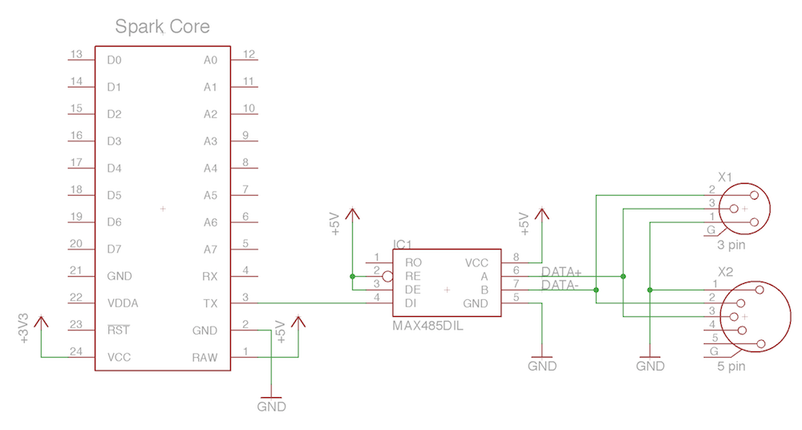

# Spark Core E1.31 RX/DMX TX
This is a simple application for the Spark Core that receives E1.31 over WiFi and transmits it over DMX.

The received DMX universe is stored and transmitted over DMX with a refresh rate of 25Hz.

The color of the RGB LED is determined by the first 3 channels and the small blue LED toggles every time the DMX universe is sent.

## Compiling
__This code will not work in Sparks online IDE!__
You have to compile it yourself or upload the firmware without changes.

The reason for this is that the buffer in Sparks UDP library is set to 512 bytes.
ArtDMX-packages are 530 in length, so only the last 18 bytes will be received by the application.
To receive ArtDMX packages, change

`#define RX_BUF_MAX_SIZE	512`
to

`#define RX_BUF_MAX_SIZE	640`

in the file `core-firmware/inc/spark_wiring_udp.h`

Check out Sparks repository for information on compiling: https://github.com/spark/core-firmware

## Transmitting DMX
To transmit DMX you need an RS485-transceiver chip. Hooking up a MAX485 is simple:

  

## Sources
- ArtNet reception is based on this gist: https://gist.github.com/deftx/9377546
- DMX transmission is based on this repo: https://code.google.com/p/stm32-dmx512/
